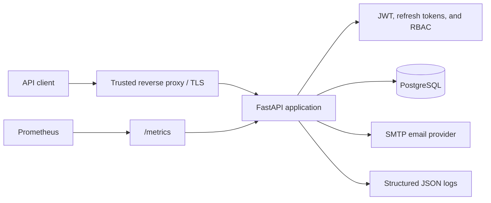
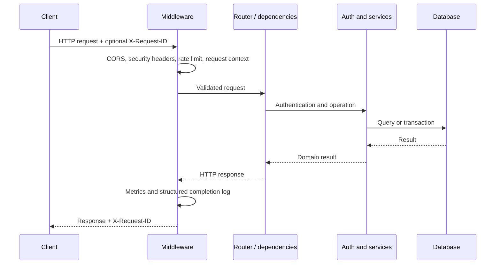

# Architecture guide

FastAPI Production API is a synchronous, layered reference application. It
keeps HTTP concerns, authentication, persistence, and operations separate so a
team can replace one part without rewriting the entire service.

## System context

The reverse proxy terminates TLS and controls trusted forwarding headers. The
application owns validation, authorization, business transactions, and
telemetry. PostgreSQL is the only required stateful dependency.

## Source layout and responsibilities

| Area | Path | Responsibility |
| --- | --- | --- |
| Application assembly | `src/app/main.py` | Create FastAPI, register middleware and handlers, include routers |
| HTTP routes | `src/app/api/v1/` | Parse requests, enforce dependencies, return response models |
| Authentication | `src/app/auth/` | Password verification, JWT validation, refresh rotation, permissions |
| Configuration | `src/app/core/` | Environment settings, logging, metrics, request context |
| Persistence | `src/app/db/`, `src/app/models/`, `src/app/repositories/` | Sessions, ORM models, and data access |
| Contracts | `src/app/schemas/` | Pydantic request and response models |
| Cross-cutting HTTP behavior | `src/app/middlewares/` | CORS, headers, rate limiting, request logging |
| Error boundary | `src/app/exceptions/` | Stable client errors and safe unexpected-error responses |
| Schema evolution | `alembic/` | Ordered PostgreSQL migrations |
| Verification | `tests/` | Endpoint, security, failure-path, and operational tests |

Routers should remain thin: validate input, compose dependencies and services,
and translate results into HTTP responses. Reusable authentication or database
behavior belongs outside route modules.

## Request lifecycle

Global exception handlers keep validation, HTTP, and unexpected failures
consistent. Unexpected exceptions are logged with their correlation ID while
the response omits internal details.

## Authentication lifecycle

1. `POST /register/` hashes the password with bcrypt before committing a user.
2. `POST /login/` verifies the password, creates a short-lived JWT access token,
   creates an opaque refresh token, and stores only the refresh-token hash.
3. Protected routes decode the JWT and validate algorithm, issuer, audience,
   expiration, token type, and subject. The current user is then loaded from the
   database, so deleted users and role changes take effect without waiting for a
   new access token.
4. `POST /auth/refresh` validates the stored token, rejects revoked or expired
   records, locks and revokes the old token, and commits a replacement in the
   same server-generated family. Replay of a rotated token revokes the family's
   live descendant.
5. `POST /auth/logout` revokes the submitted refresh-token family.
6. Registration may attach a normalized email identity. Verification requests
   invalidate older outstanding tokens, persist only a SHA-256 token hash, and
   deliver the raw token through the configured SMTP boundary.
7. Confirmation locks and atomically consumes the scoped token while setting
   `email_verified_at`. Expiry, replay, purpose, and current-email checks occur
   before the transaction commits.
8. Password-reset requests reuse the account-action token table with a distinct
   purpose and only accept active, verified email identities without revealing
   eligibility to the caller.
9. Reset confirmation locks both token and user, updates the password hash,
   consumes outstanding reset tokens, and revokes every refresh token in one
   transaction. It creates no replacement session.
10. Authenticated session endpoints aggregate active refresh-token families and
    allow idempotent revocation of one or all families while filtering every
    operation by current user ownership.

Refresh-token families detect replay and make device-level revocation possible.
Access tokens are stateless and remain valid until expiration, so clients must
discard them on logout and deployments must protect the signing secret.

## Authorization model

Authentication answers who the user is; authorization decides what that user
may do. Admin routes call the centralized permission check after resolving the
current database user. New roles or permissions should be added centrally and
covered by both allow and deny tests.

## Data and transaction boundaries

Each request receives a SQLAlchemy session through a FastAPI dependency. Write
operations explicitly commit only after all required mutations are ready and
roll back when persistence fails. Alembic migrations are the source of truth
for schema changes.

Production releases should run migrations once before starting new application
workers. Do not let every worker race to apply schema changes.

## Observability model

- `/health/live` reports process liveness without dependency checks.
- `/health/ready` verifies database connectivity before accepting traffic.
- `/metrics` exports bounded-label request count, status, latency, and
  in-progress metrics.
- JSON request logs carry method, normalized path, status, duration, and a
  validated correlation ID.

Read [MONITORING.md](MONITORING.md) for scrape configuration, multi-worker
metrics, alerts, and troubleshooting.

## Configuration and trust boundaries

Settings come from environment variables and `.env`; process environment values
take precedence. Production validation rejects debug mode and short or known
placeholder secrets. SMTP delivery is opt-in and requires a host and sender;
disabled delivery does not create unreachable tokens. CORS origins, proxy
trust, metrics exposure, database permissions, and secret storage remain
deployment responsibilities.

## Safe extension points

- Add a route in `src/app/api/v1/` and register its router in `main.py`.
- Put new request and response contracts in `src/app/schemas/`.
- Isolate reusable business rules in services and data access in repositories.
- Create an Alembic revision for every schema change.
- Add success, authorization, validation, rollback, and edge-case tests.
- Add low-cardinality metrics; never use usernames, IDs, or raw URLs as metric
  labels.

Run `python scripts/dev.py check` before review.

## Intentional limitations

The current rate limiter is process local, refresh-token persistence and SMTP
delivery are synchronous, and the repository does not include MFA, immediate
JWT revocation, a distributed cache, or a production container image. Password
reset revokes refresh tokens, but existing stateless access tokens remain valid
until expiry. SMTP acceptance is not a durable delivery guarantee; applications
requiring that guarantee should add a transactional outbox and worker. These
are explicit roadmap items rather than hidden production claims. See
[ROADMAP.md](ROADMAP.md) and [DEPLOYMENT.md](DEPLOYMENT.md) before adopting the
foundation.
