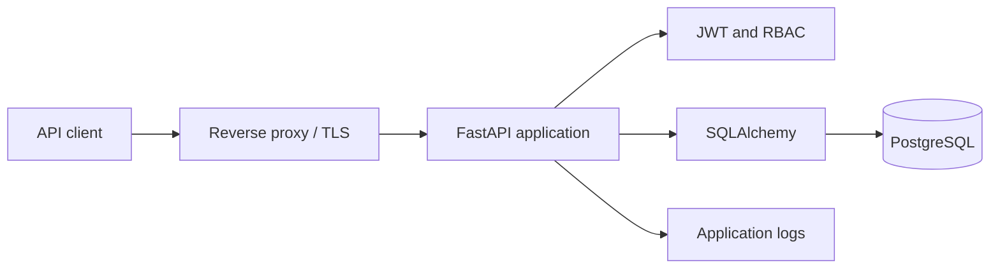

# FastAPI Production API

[](https://github.com/HoungDev/fastapi-production-api/actions/workflows/ci.yml)
[](https://www.python.org/)
[](https://fastapi.tiangolo.com/)
[](LICENSE)
[](https://github.com/HoungDev/fastapi-production-api/releases)

Ship a security-focused FastAPI backend without rebuilding authentication,
database migrations, testing, and CI from scratch.

FastAPI Production API is an open-source foundation for developers who want a
clear starting point for maintainable API services. It includes PostgreSQL,
SQLAlchemy, Alembic, access and refresh tokens, role-based authorization,
security middleware, automated tests, and a release-ready GitHub workflow.

> [!IMPORTANT]
> This repository is a foundation, not a substitute for a threat model. Review
> the [known limitations](#known-limitations) and adapt the defaults to your
> infrastructure before serving production traffic.

## Why this template?

| Production concern | Included foundation |
| --- | --- |
| Authentication | JWT access tokens and hashed, rotating refresh tokens |
| Authorization | User and admin roles with protected endpoints |
| Database lifecycle | PostgreSQL, SQLAlchemy, and Alembic migrations |
| API hardening | CORS, security headers, rate limiting, and error handlers |
| Reliability | Health checks, transaction rollback, and request logging |
| Quality | Pytest, Ruff, dependency audit, and GitHub Actions CI |
| Operations | Environment-based configuration and Gunicorn/Uvicorn guidance |

## Quick start

### Requirements

- Python 3.13+
- [uv](https://docs.astral.sh/uv/)
- Docker, or a local PostgreSQL server

### 1. Clone and configure

```bash
git clone https://github.com/HoungDev/fastapi-production-api.git
cd fastapi-production-api
cp .env.example .env
```

On PowerShell, replace the last command with:

```powershell
Copy-Item .env.example .env
```

Generate a secret and assign the result to `SECRET_KEY` in `.env`:

```bash
uv run python -c "import secrets; print(secrets.token_urlsafe(48))"
```

### 2. Start PostgreSQL and install dependencies

```bash
docker compose up -d postgres
uv sync --locked
```

If PostgreSQL is already running, update `DATABASE_URL` in `.env` and skip the
Docker command.

### 3. Migrate and run

```bash
uv run alembic upgrade head
uv run uvicorn app.main:app --reload
```

Open:

- API: <http://localhost:8000>
- Swagger UI: <http://localhost:8000/docs>
- ReDoc: <http://localhost:8000/redoc>
- Health: <http://localhost:8000/health>

## Included capabilities

### Authentication and authorization

- Registration and OAuth2 password login
- JWT issuer, audience, expiration, subject, and token-type validation
- Hashed refresh tokens with rotation and revocation
- bcrypt password hashing
- Current-user endpoints and role-based admin routes

### API and data layer

- FastAPI and Pydantic request/response models
- PostgreSQL with SQLAlchemy ORM
- Alembic schema migrations
- Database and application health checks
- Environment-based settings

### Security and reliability

- Configurable CORS
- Security response headers
- Request logging
- Global exception handling
- Transaction rollback on write failures
- In-memory request rate limiting

## Architecture



```text
fastapi-production-api/
├── .github/                # CI and community configuration
├── alembic/                # Database migrations
├── src/app/                # FastAPI application
├── src/fastapi_production_api/
│   └── __init__.py         # Package version and CLI entry point
├── tests/                  # Automated test suite
├── docker-compose.yml      # Local PostgreSQL service
├── gunicorn.conf.py        # Linux process-manager configuration
└── pyproject.toml          # Metadata, dependencies, and tool settings
```

## API overview

| Method | Path | Purpose |
| --- | --- | --- |
| `GET` | `/health` | Application health |
| `GET` | `/health/db` | Database connectivity |
| `POST` | `/register/` | Create a user |
| `POST` | `/login/` | Issue access and refresh tokens |
| `POST` | `/auth/refresh` | Rotate a refresh token |
| `POST` | `/auth/logout` | Revoke a refresh token |
| `GET` | `/auth/me` | Return the authenticated user |
| `GET` | `/admin/users` | List users as an admin |

The generated OpenAPI document at `/docs` is the source of truth for the full
request and response schemas.

## Quality checks

Run the same checks used by CI:

```bash
uv sync --locked --all-groups
uv run ruff check .
uv run ruff format --check .
uv run alembic upgrade head
uv run pytest
uv run pip-audit
uv build
```

CI runs against PostgreSQL 17 rather than silently substituting SQLite. It also
verifies that the built wheel contains and can import the application.

## Production deployment

For a self-hosted Linux service, run Gunicorn with the maintained standalone
Uvicorn worker:

```bash
uv sync --locked --no-dev
uv run alembic upgrade head
uv run gunicorn -c gunicorn.conf.py app.main:app
```

Read [DEPLOYMENT.md](DEPLOYMENT.md) for the reverse proxy, systemd, TLS, and
deployment checklist. Container orchestration platforms should normally run one
Uvicorn process per container and scale at the container level.

## Known limitations

- Rate limiting is stored in process memory. It is not shared across workers or
  hosts; use Redis or an API gateway for distributed enforcement.
- Password reset, email verification, OAuth providers, and MFA are planned but
  are not part of the current release.
- The provided Docker Compose service runs PostgreSQL for local development; it
  does not yet build or deploy the API container.
- Deployment defaults must be reviewed for your traffic, proxy topology,
  secrets platform, backup policy, and compliance requirements.

See [ROADMAP.md](ROADMAP.md) for planned work and
[CHANGELOG.md](CHANGELOG.md) for release history.

## Contributing

Bug reports, documentation fixes, tests, and focused feature contributions are
welcome. Start with [CONTRIBUTING.md](CONTRIBUTING.md), then look for issues
labeled [`good first issue`](https://github.com/HoungDev/fastapi-production-api/issues?q=is%3Aissue%20state%3Aopen%20label%3A%22good%20first%20issue%22)
or [`help wanted`](https://github.com/HoungDev/fastapi-production-api/issues?q=is%3Aissue%20state%3Aopen%20label%3A%22help%20wanted%22).

For security vulnerabilities, follow [SECURITY.md](SECURITY.md) instead of
opening a public issue.

## Support the project

If this foundation saves you time:

- [Star the repository](https://github.com/HoungDev/fastapi-production-api)
- Share feedback in [Discussions](https://github.com/HoungDev/fastapi-production-api/discussions)
- Improve an issue or documentation page
- [Sponsor HoungDev](https://github.com/sponsors/HoungDev) when the Sponsors
  profile becomes available

## License

Distributed under the [MIT License](LICENSE). Maintained by
[@HoungDev](https://github.com/HoungDev).
