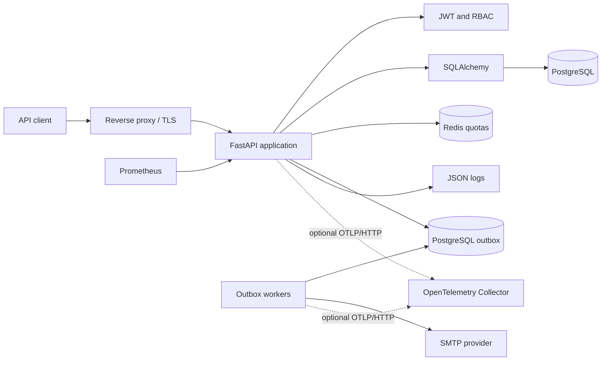

# FastAPI Production API

[](https://github.com/HoungDev/fastapi-production-api/actions/workflows/ci.yml)
[](https://www.python.org/)
[](https://fastapi.tiangolo.com/)
[](LICENSE)
[](https://github.com/HoungDev/fastapi-production-api/releases)

Ship a security-focused FastAPI backend without rebuilding authentication,
database migrations, testing, and CI from scratch.

FastAPI Production API is an open-source foundation for developers who want a
clear starting point for maintainable API services. It includes PostgreSQL,
SQLAlchemy, Alembic, access and refresh tokens, role-based authorization,
security middleware, automated tests, and a release-ready GitHub workflow.

> [!IMPORTANT]
> This repository is a foundation, not a substitute for a threat model. Review
> the [known limitations](#known-limitations) and adapt the defaults to your
> infrastructure before serving production traffic.

## Why this template?

| Production concern | Included foundation |
| --- | --- |
| Authentication | JWT, rotating refresh tokens, device sessions, and optional TOTP MFA |
| Authorization | User and admin roles with protected endpoints |
| Database lifecycle | PostgreSQL, SQLAlchemy, and Alembic migrations |
| API hardening | CORS, security headers, rate limiting, and error handlers |
| Reliability | Liveness/readiness probes, transaction rollback, and request logging |
| Quality | Pytest, Ruff, dependency audit, and GitHub Actions CI |
| Operations | Environment-based configuration and Gunicorn/Uvicorn guidance |

## Quick start

### Requirements

- Python 3.13+
- [uv](https://docs.astral.sh/uv/)
- Docker, or reachable PostgreSQL and Redis services

### 1. Clone and configure

```bash
git clone https://github.com/HoungDev/fastapi-production-api.git
cd fastapi-production-api
python scripts/dev.py setup
```

The setup command creates `.env` with a generated secret, installs locked
dependencies, starts PostgreSQL and Redis, waits for them to become healthy, and applies
migrations. It never overwrites an existing `.env`. To use existing dependency
services, configure `DATABASE_URL` and `REDIS_URL`, then add `--skip-docker`.

### 2. Run

```bash
python scripts/dev.py serve
```

Open:

- API: <http://localhost:8000>
- Swagger UI: <http://localhost:8000/docs>
- ReDoc: <http://localhost:8000/redoc>
- Health: <http://localhost:8000/health>
- Liveness: <http://localhost:8000/health/live>
- Readiness: <http://localhost:8000/health/ready>
- Prometheus metrics: <http://localhost:8000/metrics>

See [DEVELOPMENT.md](DEVELOPMENT.md) for individual commands, manual setup,
contributor workflows, and local troubleshooting.

## Documentation map

| Guide | Use it when you need to... |
| --- | --- |
| [API examples](API_EXAMPLES.md) | Register, authenticate, rotate tokens, call admin routes, and inspect operations endpoints |
| [Architecture](ARCHITECTURE.md) | Understand module boundaries, request flow, authentication, transactions, and extension points |
| [Local development](DEVELOPMENT.md) | Set up a checkout, run common commands, contribute, or troubleshoot locally |
| [Deployment](DEPLOYMENT.md) | Configure a production host, release safely, terminate TLS, and operate the service |
| [Monitoring](MONITORING.md) | Configure probes, Prometheus, multi-worker metrics, alerts, logs, and incident diagnosis |

## Included capabilities

### Authentication and authorization

- Registration and OAuth2 password login
- JWT issuer, audience, expiration, subject, and token-type validation
- Hashed refresh tokens with rotation and revocation
- Refresh-token replay detection and device-session management
- Verified email identities and single-use password recovery
- Optional TOTP MFA with encrypted seeds, one-time recovery codes, and step-up claims
- Optional provider-neutral OIDC Authorization Code login with PKCE S256
- Optional Redis cache-aside for validated public OIDC discovery and JWKS data
- bcrypt password hashing
- Current-user endpoints and role-based admin routes

### API and data layer

- FastAPI and Pydantic request/response models
- PostgreSQL with SQLAlchemy ORM
- Alembic schema migrations
- Database readiness and application liveness checks
- Environment-based settings

### Security and reliability

- Configurable CORS
- Security response headers
- Structured JSON request logging with correlation IDs
- Prometheus request count, status, latency, and in-progress metrics
- Global exception handling
- Transaction rollback on write failures
- In-memory or Redis-backed distributed request rate limiting
- Optional PostgreSQL transactional outbox with horizontally scalable workers

## Architecture



```text
fastapi-production-api/
├── .github/                # CI and community configuration
├── alembic/                # Database migrations
├── src/app/                # FastAPI application
├── src/fastapi_production_api/
│   └── __init__.py         # Package version and CLI entry point
├── tests/                  # Automated test suite
├── docker-compose.yml      # Local PostgreSQL service
├── gunicorn.conf.py        # Linux process-manager configuration
└── pyproject.toml          # Metadata, dependencies, and tool settings
```

Read [ARCHITECTURE.md](ARCHITECTURE.md) for the request lifecycle, source
boundaries, authentication rotation, transaction ownership, trust boundaries,
and safe extension points.

## API overview

| Method | Path | Purpose |
| --- | --- | --- |
| `GET` | `/health/live` | Process liveness; no dependency checks |
| `GET` | `/health/ready` | Traffic readiness and required dependencies |
| `GET` | `/metrics` | Prometheus metrics; restrict to monitoring networks |
| `POST` | `/register/` | Create a user |
| `POST` | `/login/` | Issue access and refresh tokens |
| `POST` | `/auth/refresh` | Rotate a refresh token |
| `POST` | `/auth/logout` | Revoke a refresh token |
| `GET` | `/auth/sessions` | List active device sessions |
| `DELETE` | `/auth/sessions/{session_id}` | Revoke one device session |
| `DELETE` | `/auth/sessions` | Revoke all refresh-token sessions |
| `POST` | `/auth/password-reset/request` | Request password recovery without account disclosure |
| `POST` | `/auth/password-reset/confirm` | Consume a reset token and revoke refresh sessions |
| `POST` | `/auth/mfa/totp/enroll` | Begin authenticated TOTP enrollment |
| `POST` | `/auth/mfa/totp/confirm` | Confirm enrollment and issue recovery codes |
| `POST` | `/auth/mfa/challenge/verify` | Complete an MFA login challenge |
| `GET` | `/auth/mfa/status` | Read MFA state without returning secrets |
| `GET` | `/auth/oidc/authorize` | Begin an OIDC login transaction |
| `GET` | `/auth/oidc/callback` | Validate the provider response and complete login/linking |
| `POST` | `/auth/oidc/link/authorize` | Begin explicit authenticated identity linking |
| `GET` | `/auth/oidc/identities` | List linked external identity providers |
| `GET` | `/auth/me` | Return the authenticated user |
| `GET` | `/admin/users` | List users as an admin |

The generated OpenAPI document at `/docs` is the source of truth for the full
request and response schemas.

## Durable email worker

Set `EMAIL_DELIVERY_MODE=outbox`, configure SMTP, and generate a dedicated
`OUTBOX_ENCRYPTION_KEY`. Apply migrations before starting one or more workers:

```bash
uv run fastapi-production-worker
```

Each worker uses PostgreSQL `FOR UPDATE SKIP LOCKED` leases, so processes claim
disjoint work without holding transactions during SMTP calls. Delivery is
at-least-once: a crash after SMTP accepts a message but before finalization may
produce a duplicate. Terminal jobs retain safe metadata but purge encrypted
recipients and lifecycle tokens; request a new token instead of replaying them.

## Optional distributed tracing

OpenTelemetry tracing is opt-in and disabled by default. When enabled, the
application exports traces over OTLP/HTTP and instruments FastAPI requests,
SQLAlchemy operations, HTTPX calls, Redis operations, and transactional outbox
worker execution.

Example local configuration:

    TRACING_ENABLED=true
    OTEL_SERVICE_NAME=fastapi-production-api
    OTEL_EXPORTER_OTLP_ENDPOINT=http://localhost:4318
    OTEL_EXPORT_TIMEOUT_SECONDS=5
    OTEL_TRACE_SAMPLE_RATIO=1.0

Production deployments should normally export to an OpenTelemetry Collector
and use a sampling ratio appropriate for traffic volume.

Structured JSON logs retain `request_id` and additionally include `trace_id`
and `span_id` while a valid OpenTelemetry span is active.

Tracing deliberately avoids recording authorization headers, cookies,
request/response bodies, lifecycle tokens, OIDC state/nonce/PKCE data,
credentials, raw email addresses, and query-string values.

Transactional outbox propagation stores only bounded W3C `traceparent` and
`tracestate` metadata so worker activity can remain correlated with the
originating request.

Tracing is an observability feature, not a correctness or readiness dependency.
Collector or exporter failure must not make otherwise valid API requests or
worker jobs fail.

See [MONITORING.md](MONITORING.md) for trace correlation and operational
diagnostics and [DEPLOYMENT.md](DEPLOYMENT.md) for production rollout guidance.

## Quality checks

Run the same checks used by CI:

```bash
python scripts/dev.py check
```

Pytest measures statement and branch coverage for the application packages and
fails below 90%. CI also publishes `coverage.xml` as a workflow artifact for
review and downstream reporting.

CI runs against PostgreSQL 17 rather than silently substituting SQLite. It also
verifies that the built wheel contains and can import the application.

## Production deployment

For a self-hosted Linux service, run Gunicorn with the maintained standalone
Uvicorn worker:

```bash
uv sync --locked --no-dev
uv run alembic upgrade head
uv run gunicorn -c gunicorn.conf.py app.main:app
```

Read [DEPLOYMENT.md](DEPLOYMENT.md) for the reverse proxy, systemd, TLS, and
deployment checklist, and [MONITORING.md](MONITORING.md) for probes, Prometheus,
multi-worker metrics, alerting, and troubleshooting. Container orchestration
platforms should normally run one Uvicorn process per container and scale at
the container level.

## Known limitations

- The Redis limiter targets a single Redis deployment. Redis Cluster, Sentinel,
  Active-Active, and cross-region quota guarantees are outside this release.
- OIDC caching is disabled by default. Redis mode caches only bounded public
  discovery/JWKS documents; it never caches tokens, claims, users, sessions,
  permissions, or authentication/authorization decisions. Unknown signing keys
  force one provider refresh and remain rejected if still absent.
- OIDC support is a provider-neutral example and requires provider registration,
  exact redirect configuration, and application-specific threat-model review.
- TOTP reduces password-only risk but is not phishing resistant. Prefer
  WebAuthn/passkeys when the application requires phishing-resistant MFA.
- The provided Docker Compose service runs PostgreSQL for local development; it
  does not yet build or deploy the API container.
- Deployment defaults must be reviewed for your traffic, proxy topology,
  secrets platform, backup policy, and compliance requirements.

See [ROADMAP.md](ROADMAP.md) for planned work and
[CHANGELOG.md](CHANGELOG.md) for release history.

## Contributing

Bug reports, documentation fixes, tests, and focused feature contributions are
welcome. Start with [CONTRIBUTING.md](CONTRIBUTING.md), then look for issues
labeled [`good first issue`](https://github.com/HoungDev/fastapi-production-api/issues?q=is%3Aissue%20state%3Aopen%20label%3A%22good%20first%20issue%22)
or [`help wanted`](https://github.com/HoungDev/fastapi-production-api/issues?q=is%3Aissue%20state%3Aopen%20label%3A%22help%20wanted%22).

For security vulnerabilities, follow [SECURITY.md](SECURITY.md) instead of
opening a public issue.

## Support the project

If this foundation saves you time:

- [Star the repository](https://github.com/HoungDev/fastapi-production-api)
- Share feedback in [Discussions](https://github.com/HoungDev/fastapi-production-api/discussions)
- Improve an issue or documentation page
- [Sponsor HoungDev](https://github.com/sponsors/HoungDev) when the Sponsors
  profile becomes available

## License

Distributed under the [MIT License](LICENSE). Maintained by
[@HoungDev](https://github.com/HoungDev).
